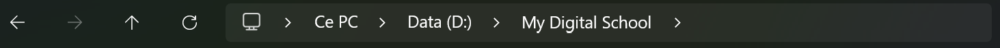
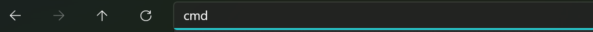
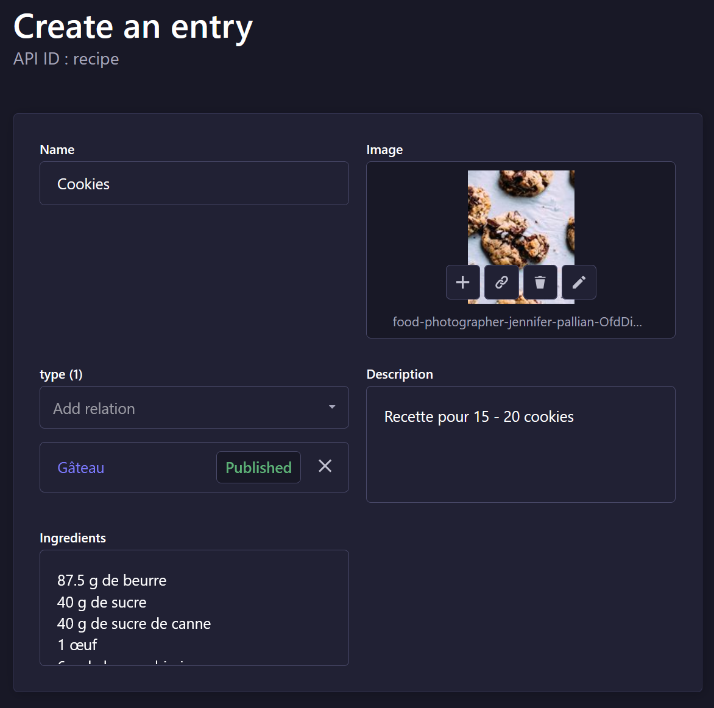
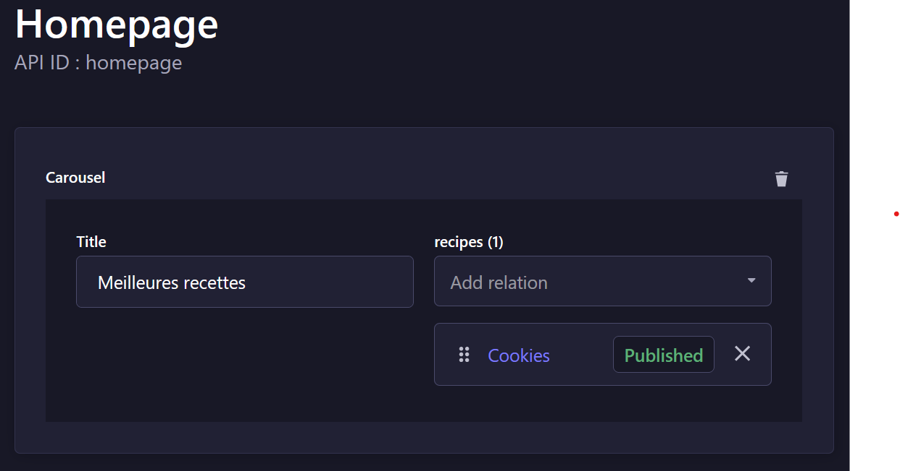

# Réalisé par Ludovic Lahougue - M2 DFS

***

# Installation

- ## Par clonage (plus rapide si git est installé sur votre machine)

Rendez-vous dans le répertoire où vous souhaitez placer le dossier et ouvrez un terminal à cet emplacement.

Exécutez cette commande
```bash
git clone https://github.com/Cendros/mds_cms.git
```

- ## Par téléchargement

Téléchargez le fichier .zip et décompressez le dans un dossier sur votre machine.

## Prérequis
- Version de node : entre 18.0.0 et 20.x.x
- npm installé sur votre machine (vous pouvez également utiliser yarn pour certaines commandes)

## Conseil

Pour l'installation, vous aurez besoin d'ouvrir des terminaux pour vous rendre dans des dossier.

Il existe un raccourci sur windows pour ouvrir un terminal directement au chemin souhaité.

Pour cela, rendez vous dans le dossier où vous voulez ouvrir le terminal et cliquez dans la barre à côté du chemin.



Puis écrivez *cmd* et appuyez sur entrée.



Votre terminal est maintenant ouvert dans ce dossier.

***

## Partie admin

Ouvrez un terminal à la racine du projet et dirigez vous dans le dossier *back*.
```bash
cd back
```

Installez les dépendances
```bash
yarn
### OU ###
npm i
```

Importez les données
```bash
yarn strapi import -f export.tar.gz.enc --force --key root
### OU ###
npx strapi import -f export.tar.gz.enc --force --key root
```

Démarrez le serveur
```bash
yarn start
### OU ###
npm run start
```

## Partie application

Ouvrez un terminal à la racine du projet et dirigez vous dans le dossier *front*.
```bash
cd front
```

Installez le module serve
```bash
npm i -g serve
```

Démarrez l'application
```bash
serve -s build
```

Rendez-vous sur l'adresse indiqué par le terminal pour accéder à l'application.

### Note

L'application a été conçue pour être exclusivement une application mobile. Il est donc fortement conseillé de mettre votre navigateur en vue mobile.

- Sur Firefox : Ctrl + Maj + m
- Sur Chrome : Ctrl + Maj + c puis Ctrl+ Maj + m

***
# Documentation

Cette documentation vous permettra d'utiliser le back office de l'application de recettes afin de créer votre contenu.

# Accès

Une fois que le serveur de Strapi est accessible, ouvrez l'adresse suivante sur votre navigateur : [http://localhost:1337/admin](http://localhost:1337/admin). Vous arriverez sur le formulaire de connexion.

Connectez vous avec ces identifiants :
- email : admin@recipe.fr
- mot de passe : Admin123

# Créations d'entité

Pour la démonstration de création d'entités, nous créerons une recette de cookies (cette recette est déjà dans la base de données à l'installation).

## Types de recettes

Les types de recette vous permettent de classer vos recette dans une catégorie (entrée, viande, gâteau, ...).
***

Pour créer un type, rendez-vous dans le menu *Content Manager* > *Collection Types* > *Type* et appuyer sur le bouton **Create new entry**.
Entrez le nom du type que vous souhaitez créer et appuyer sur **Save**.
	Lorsque vous aurez des recettes enregistrées, vous pourrez les associer directement à ce type avec le sélecteur *recipes*.

***
#### Appuyez sur le bouton *Publish* pour rendre ce type accessible.
***

## Recettes

Pour créer une recette, rendez-vous dans le menu *Content Manager* > *Collection Types* > *Recipe* et appuyer sur le bouton **Create new entry**.
Entrez les informations suivantes :
- Name : nom de la recette
- Image : Téléversez vos images pour les associer aux recettes
- type : Le type de la recette créé précédemment.
- Description : Une description de la recette
- Ingrédients : La liste des ingrédients



***
#### Appuyez sur le bouton *Save* et *Publish* pour rendre cette recette accessible.
***

La recette est maintenant visible sur l'application.

# Création d'un carrousel

Vous avez la possibilité de créer un carrousel pour mettre des recettes en avant sur la page d'accueil. Pour cela rendez vous dans le menu *Content Manager* > *Single Type* > *Homepage* et appuyez sur le bouton +.
Entrez un titre qui sera affiché au dessus du carrousel et sélectionnez les recettes que vous voulez afficher.



***
#### Appuyez sur le bouton *Save* et *Publish* pour rendre le carrousel visible.
***

# Diagrammes

Les différents diagrammes de l'application sont disponibles à la racine du projet sous forme de fichers PNG.
